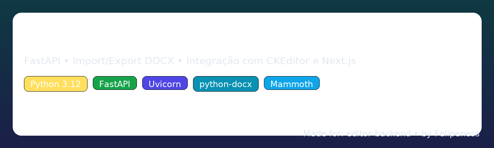

<p align="center">
  
</p>

<h1 align="center">Editor Backend — FastAPI + DOCX</h1>

<p align="center">
  <a href="https://www.python.org/"></a>
  <a href="https://fastapi.tiangolo.com/"></a>
  <a href="https://www.uvicorn.org/"></a>
  <a href="https://pypi.org/project/python-docx/"></a>
  <a href="https://pypi.org/project/mammoth/"></a>
  
  
</p>

> A tiny, production‑ready backend that converts **DOCX ⇄ HTML** with **high fidelity**.
> Built with **FastAPI**, tuned for **Next.js** front‑ends (CKEditor & contentEditable).

---

## Table of Contents

- [Why this project?](#why-this-project)
- [Architecture](#architecture)
- [Tech Stack](#tech-stack)
- [Quickstart](#quickstart)
  - [Windows (PowerShell)](#windows-powershell)
  - [Linux / macOS (bash/zsh)](#linux--macos-bashzsh)
- [Environment & Config](#environment--config)
- [API](#api)
  - [GET `/health`](#get-health)
  - [POST `/docx/import`](#post-docximport)
  - [POST `/docx/export`](#post-docxexport)
- [Data Contracts](#data-contracts)
- [Conversion Notes](#conversion-notes)
- [Project Structure](#project-structure)
- [Development](#development)
- [Troubleshooting](#troubleshooting)
- [Roadmap](#roadmap)
- [License](#license)

---

## Why this project?

- **Faithful export**: headings inside lists, nested lists, bold/italic, links, alignment.
- **Safe import**: DOCX → clean HTML (Mammoth) with a small whitelist.
- **Frontend‑friendly**: matches a typical Next.js editor pipeline (CKEditor / custom editor).
- **Windows‑first docs**: zero‑friction setup in PowerShell (works on Linux/macOS too).

## Architecture

```mermaid
flowchart LR
  A[Next.js Frontend<br/>CKEditor / contentEditable]
    -- POST /docx/import (multipart) --> B(FastAPI)
  A <-- POST /docx/export (JSON) --- B
  B --> C[Mammoth<br/>.docx → HTML]
  B --> D[python-docx + lxml<br/>HTML → .docx (custom mapper)]
  B -.-> E[(Memory)]
```

## Tech Stack

- **FastAPI** + **Uvicorn** (ASGI)
- **Mammoth** for `.docx → HTML`
- **python‑docx** + **lxml** for `HTML → .docx`
- **pydantic v2** for request/response models
- **BS4** for light HTML sanitation

---

## Quickstart

### Windows (PowerShell)

```powershell
# 0) (optional) Allow scripts for this session
Set-ExecutionPolicy -Scope Process -ExecutionPolicy Bypass

# 1) Create & activate venv (Python 3.12)
python -m venv .venv
.\.venv\Scripts\Activate.ps1

# 2) Install deps
python -m pip install --upgrade pip
pip install -r requirements.txt

# 3) Run dev server
uvicorn app.main:app --reload --host 127.0.0.1 --port 8000
```

### Linux / macOS (bash/zsh)

```bash
python -m venv .venv
source .venv/bin/activate
python -m pip install --upgrade pip
pip install -r requirements.txt
uvicorn app.main:app --reload --host 127.0.0.1 --port 8000
```

Now open:

- Swagger: <http://127.0.0.1:8000/docs>
- ReDoc: <http://127.0.0.1:8000/redoc>

> **CORS** is pre‑configured for `http://localhost:3000` and `http://127.0.0.1:3000`. Adjust in `app/main.py` if needed.

---

## Environment & Config

No mandatory env vars. You can choose the port when running Uvicorn:

```powershell
uvicorn app.main:app --reload --host 127.0.0.1 --port 8000
```

---

## API

### GET `/health`

Health probe.

**Response**

```json
{ "ok": true }
```

---

### POST `/docx/import`

`multipart/form-data` upload for a single `.docx` file → returns cleaned HTML + basic metadata.

**Request**

- **Content‑Type**: `multipart/form-data`
- **Field**: `file`: the `.docx`

**Response (200)**

```json
{
  "html": "<p>…</p>",
  "metadata": {
    "title": "Untitled",
    "author": "Anonymous"
  }
}
```

**Errors**

- `400` — wrong extension or invalid file

**curl**

```bash
curl -X POST "http://127.0.0.1:8000/docx/import" \
  -H "Accept: application/json" \
  -F "file=@./sample.docx"
```

**Next.js (TypeScript)**
```ts
const fd = new FormData();
fd.append("file", file);
const res = await fetch("http://127.0.0.1:8000/docx/import", {
  method: "POST",
  body: fd,
});
if (!res.ok) throw new Error(`HTTP ${res.status}`);
const { html, metadata } = await res.json();
```

---

### POST `/docx/export`

Accepts HTML + metadata and returns a **downloadable `.docx`**.

**Request (application/json)**

```json
{
  "html": "<p>Start writing…</p>",
  "meta": {
    "title": "My Document",
    "author": "Me"
  }
}
```

**Response**

- **200** — `application/vnd.openxmlformats-officedocument.wordprocessingml.document`
- Headers include `Content-Disposition: attachment; filename="My Document.docx"`

**curl**

```bash
curl -X POST "http://127.0.0.1:8000/docx/export" \
  -H "Content-Type: application/json" \
  --data '{ "html": "<h1>Hello</h1><p>World</p>", "meta": { "title": "Hello", "author": "You" } }' \
  --output out.docx
```

**Next.js (TypeScript)**
```ts
const res = await fetch("http://127.0.0.1:8000/docx/export", {
  method: "POST",
  headers: { "Content-Type": "application/json" },
  body: JSON.stringify({
    html: editorHtml,
    meta: { title, author },
  }),
});
if (!res.ok) throw new Error(`HTTP ${res.status}`);
const blob = await res.blob();
saveAs(blob, `${title || "document"}.docx`); // e.g. using FileSaver.js
```

---

## Data Contracts

`app/schemas.py` (pydantic v2):

- **`ImportDocxResponse`**
  - `html: str` (sanitized HTML)
  - `metadata: { title?: str, author?: str }`

- **`ExportDocxRequest`**
  - `html: str`
  - `meta: { title?: str, author?: str }`

---

## Conversion Notes

- **DOCX → HTML**: *Mammoth* prioritizes clean semantic HTML. Some advanced styling may be simplified.
- **HTML → DOCX**: The custom mapper in `app/converters/html_to_docx.py` preserves headings, bold/italic, links, lists (including nested), and basic alignment.
  - Headings **inside lists** are supported via a `data-heading` + `.li-text` strategy from the frontend.
  - Numbered lists use a pre‑defined numbering reference (`num`) for consistent output.
- If fidelity of a specific element is critical (e.g., tables, images), extend the mapper accordingly.

---

## Project Structure

```
editor-backend/
├─ app/
│  ├─ converters/
│  │  ├─ docx_to_html.py       # Mammoth pipeline (.docx → HTML + metadata)
│  │  └─ html_to_docx.py       # python-docx pipeline (HTML → .docx)
│  ├─ schemas.py               # pydantic models
│  └─ main.py                  # FastAPI app (CORS, routes)
├─ requirements.txt
├─ README.md
└─ banner.png
```

---

## Development

- Run with hot‑reload:
  ```bash
  uvicorn app.main:app --reload --host 127.0.0.1 --port 8000
  ```
- Docs at `/docs` (Swagger) and `/redoc`.
- Format/lint: up to you (e.g., `ruff`, `black`).

---

## Troubleshooting

- **400 on `/docx/import`**
  Ensure you send `multipart/form-data` with a `file=@path.docx`. Frontend must use `FormData`.
- **CORS errors**
  Confirm the origin (`http://localhost:3000`) is listed in `allow_origins` in `main.py`.
- **Windows “Activation/ExecutionPolicy”**
  If venv activation fails, run:
  `Set-ExecutionPolicy -Scope Process -ExecutionPolicy Bypass`
- **`ModuleNotFoundError` in app**
  Verify you’re using the **venv** interpreter:
  `.\.venv\Scripts\python.exe -m pip list` and `where python`

---

## Roadmap

- [ ] Tables & images round‑trip
- [ ] Page setup (A4/Letter) hints from frontend → DOCX section props
- [ ] More robust HTML sanitation profiles
- [ ] Dockerfile + CI pipeline

---

## License

MIT — do your thing. If you ship this, consider keeping a link back ⭐

---

### Acknowledgements

- [FastAPI](https://fastapi.tiangolo.com/)
- [Mammoth](https://pypi.org/project/mammoth/)
- [python-docx](https://python-docx.readthedocs.io/)
- [lxml](https://lxml.de/)
